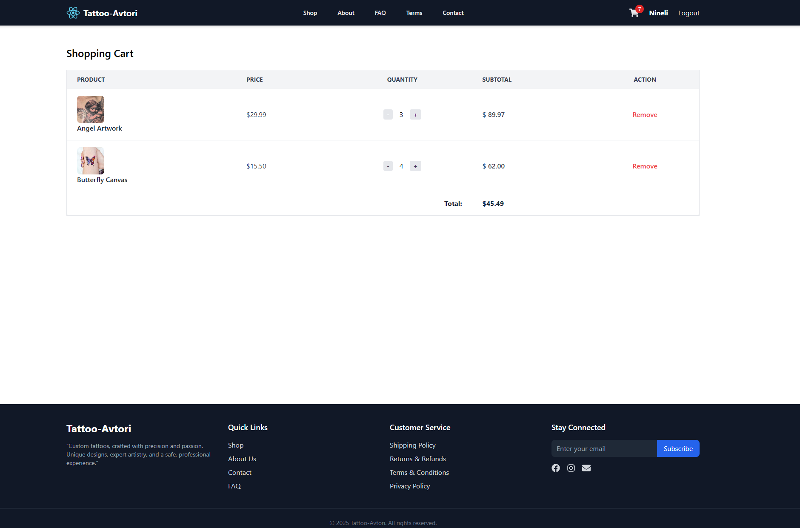

# 🎨 Tattoo-Avtori E-Commerce Website

An e-commerce platform for a tattoo artist, built with **React.js**.  
The website allows users to explore tattoo artworks, read about the artist, shop products, manage their cart, and authenticate securely.  

---

## 🚀 Features

- **Home Page**
  - Hero section with bold branding.
  - Bestsellers showcase.
  - Testimonials from clients.

- **Shop**
  - Product listing with images, descriptions, and prices.
  - Category filter for easy browsing.
  - Single product detail pages.

- **Cart**
  - Add, remove, and manage items.
  - Cart badge with item count in header.

- **Authentication**
  - Login and Register pages.
  - Authentication handled via **Context API**.
  - Protected routes for logged-in users.

- **Pages**
  - About
  - FAQ
  - Terms & Conditions
  - Contact

- **Responsive Design**
  - Fully responsive layout with mobile-friendly navigation (hamburger menu).

---

## 🛠️ Tech Stack

- **Frontend Framework**: [React.js](https://reactjs.org/)
- **Forms & Validation**: [React Hook Form](https://react-hook-form.com/) + [Zod](https://zod.dev/)
- **State Management**: Context API (for Authentication & Cart)
- **Routing**: [React Router DOM](https://reactrouter.com/)
- **UI & Styling**: [Tailwind CSS](https://tailwindcss.com/)
- **Icons**: [React Icons](https://react-icons.github.io/react-icons/)

---

## 📂 Project Structure

```bash
src/
│── components/        # Reusable UI components (Header, Footer, ProductCard, etc.)
│── pages/             # Page components (Home, Shop, About, Contact, etc.)
│── providers/         # Context providers (AuthProvider, CartProvider)
│── hooks/             # Custom hooks if any
│── api/               # API helpers (mock/fetch functions)
│── App.js             # Main app entry point
│── index.js           # React DOM rendering
```

---

## ⚙️ Installation & Setup

1. **Clone the repository**
   ```bash
   git clone https://github.com/yourusername/tattoo-avtori-ecommerce.git
   cd tattoo-avtori-ecommerce
   ```

2. **Install dependencies**
   ```bash
   npm install
   ```

3. **Run the development server**
   ```bash
   npm start
   ```

4. **Build for production**
   ```bash
   npm run build
   ```

---

## 🔑 Authentication

- Authentication state is managed with **Context API**.
- Fake tokens are stored in **localStorage**.
- Protected routes redirect unauthorized users to the login page.

---

## 🛒 Cart Functionality

- Add/remove products from the cart.
- Cart state managed with **Context API**.
- Cart persists in session/local storage (optional extension).

---

## 📌 Roadmap / Future Improvements

- Add product search functionality.
- Improve animations and transitions.
- Integrate real backend (Node.js / Express + Database).
- Checkout and Payment gateway integration (Stripe/PayPal).
- Admin dashboard for managing products, orders, etc.

---

## 📸 Screenshots

### 🏠 Home Page


### 🛍️ Shop Page


### 📄 Single Product Page


### 🛒 Cart Page



### 🔑 Login Page


### 🆕 Register Page


---

👩‍🎨 Developed for **Tattoo-Avtori** — a modern e-commerce experience for tattoo lovers.
